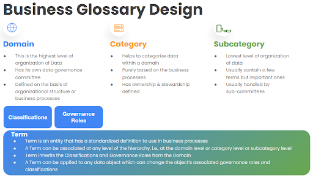
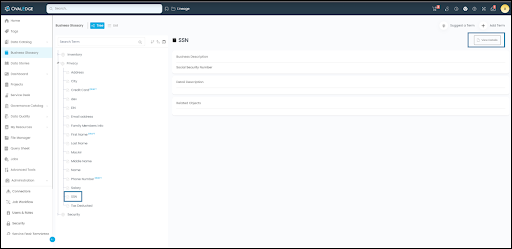

author: Amjad Ali
id: getting_started_with_ovaledge
summary: This is a sample Snowflake Ovaledge
categories: Getting-Started
environments: web
status: Published 
feedback link: https://github.com/Snowflake-Labs/sfguides/issues
tags: Getting Started, Data Science, Data Engineering, Twitter 

# Learn How Ovaledge Powers Data Intelligence on Snowflake
<!-- ------------------------ -->
## OvalEdge Data Governance
Duration: 1

OvalEdge is a comprehensive Data Governance Platform that empowers users with
data access, provides standardized definitions for business processes, and helps
improve data quality. It promotes data adoption through comprehensive
programs and guidelines, and offers self-service tools for compliance, data
comparison, and AI-driven data classification. With features like Query Sheets and
impact analysis tools, OvalEdge serves as a comprehensive solution for data
governance and utilization.

 OvalEdge's Data Governance process involves:

+  Creating a Data Catalog through data source crawling and profiling using OvalEdge's extensive collection of connectors.

+  Enhancing Data Discovery and Consumption through the three core pillars of OvalEdge's Data Governance methodology:

   + **Data Literacy:** Curating metadata with standard definitions for a common understanding of business concepts.

   + **Data Access:** Protecting PII, intellectual property, and confidential data to comply with privacy laws.

   + **Data Quality:** Continuous improvement through data quality rules, scores, anomaly detection, and collaborative workflows via the Service Desk.

OvalEdge also offers user-friendly self-service tools for data loading and collaboration, maximizing user productivity.

End-to-end data governance offers several benefits:
+ Centralized Data Catalog for easy information access

+ Streamlined access and service requests

+ Efficient issue request management and notifications

+ Enhanced data quality trust

+ Standardized business term meanings

+ A precise level of control for users and objects

+ Privacy compliance and confidentiality through masking and restrictions

+ Support for customer requests regarding information and data deletion

+ Distributed governance responsibilities among stewards, owners, and custodians

+ AI-driven classification tools

+ Self-service tools for maximum efficiency and user productivity.

### What You’ll Learn

### What You’ll Need

+ A Snowflake trial account with ACCOUNTADMIN privileges or an existing Snowflake account with ACCOUNTADMIN privileges.
+ OvalEdge free 14-day trial through Snowflake Partner Connect.

## Snowflake Lab Environment Setup for OvalEdge
Duration: 2
\-

Idea is that OvalEdge provides a data dump which have a story to tell, and customer import that data into its own environment.

+ Please follow this [link](https://signup.snowflake.com/), fill out the form, and click the ‘Continue’ button.

+ When asked to choose a cloud provider, choose any one of your choice (any one of them is good for this workshop purpose).

+ After checking the checkbox to agree to the terms, click the 'Get Started' button.

+ You will then be prompted for the reason you are signing up for a Snowflake trial account. Choose "OvalEdge Workshop" and any others that may apply, and click on ‘Submit’.

### Provisioning OvalEdge Trial

Idea is that OvalEdge is up and running and comes with pre-loaded sample data with the following

+ Source (SQL Server/Oracle)

+ Snowflake (Within OvalEdge account)

+ Tableau Public (Shows Tableau in Connector but connected to Tableau Public so that reports are viewable)

1\. Go to Partner Connect from your Snowflake Trial Account

+ Click on ‘Admin > Partner Connect’ from the left navigation bar.

+ Select ‘Partner Connect’.

+ Type ‘OvalEdge’ in the search

**NEED TO PUT THE SCREENSHOTS AND DETAILS OF CONNECTING TO OVALEDGE.**

 

**Introduction Video**

Who will be providing the content and who would be recording the video? Need the procedure and screens about logging into OvalEdge on Snowflake Theme of the Demo? (Alation used Juno, a fictitious streaming company) Home page is used as landing page with the information and videos about how to get started.

## Finding & Understanding Data with Data Catalog
Duration: 3

This section provides insights into the methods for discovering data objects through tags, search, and the data catalog. You can access desired objects and obtain summarized details, including metadata and statistics. Additionally, you can explore sample data, entity relationships, data lineage, references, and column details for a comprehensive understanding of each object.

### Workshop

In this workshop, you will learn about utilizing tags for data search, exploring data objects through search functionalities, and discovering data within the data catalog.Let's consider an example of “Inventory Management”, where multiple schemas and tables are managed across different data sources. We will focus on the "DIMINVENTORY" table and explore its related information.

### Search Data using Tags
After the data is crawled from various sources, data objects can be grouped using tags for efficient management and discovery.
+ Navigate to the "Tags" module and select the "Tree View" option (1 & 2).
+ Search for the "Inventory Data" tag. The data objects assigned to the selected tag will be displayed in their respective tabs (e.g., Schema, Tables, Files,Reports) (3 & 4).
+ Within the “Tables” tab, locate and click on the "DIMINVENTORY" table (5 & 6).

**Explore Data Object Summary**

+ In the “DIMINVENTORY” table summary page, gain insights into the various crawled data, profile statistics, scores, child object count, and different dates associated with the table.

**Note:** Users with Meta-Write permissions can edit curatable fields like Business Description, Technical Description, and Custom Fields.

+ Assign terms and tags to enhance object classification.

## View Entity Relationships
 Duration: 4

Switch to the Entity Relationships tab and explore logical links between tables based on primary and foreign key relationships.

**Visualize Data Lineage**

+ Navigate to the “Lineage” tab and visualize the flow of data from source to destination, including any transformations.

+ Identify intermediate objects involved in the data transformation process.

+ In the lineage, the Product Table sourced from SQL Server is transferred to Snowflake Staging and Snowflake Data Warehouse using SSIS packages. The Inventory Forecast Report, which serves as the target output, is generated in Tableau.

**Additional Details:** Access sample data, references to data objects, and column details for further exploration and understanding.

### Searching for Data Objects

**Use the Search bar:** Search for objects that match your input by using the Search bar.You can filter the results based on object type or certification. Searchable objects include Data Objects, Codes, Terms, Tags, Projects, Data Stories, and Service Requests.

**Find an "Inventory Report":** To locate an "Inventory Report," enter the keyword "Inventory" in the Search bar and press enter. The search results will display objects matching the keyword.

**Refine the search:** Go to the Reports tab in the top menu and use the left panel filters to narrow down your search. Choose relevant fields like connection name, report group, report type, tag name, etc. Click the "Apply Filter" button to update the search results accordingly.

**Explore the “Inventory Report”**: Click on the "Inventory Report". Explore the Summary page to gather insights and information about the report. Click on the Tableau Report link at the bottom of the page. The report including Inventory Turnover, Inventory Week On Hand, Day Inventory, and Stock to Sales Ratio details is displayed.

**Bookmark the Inventory Report:** To save the Inventory Report for quick access, click on the Bookmark icon provided in the top header menu.

**Visualize Data Lineage:** Open the Lineage tab to visualize the data flow from the source to the final destination. This helps you understand how the Inventory Forecast report is generated and the sub-reports associated with it.

**Complex Data Discovery using Data Catalog**

You can filter, search, and sort tables in the Data Catalog. Click on the "8 dots" to access conditional search options. Use Tags to group catalog objects based on specific criteria. To group catalog objects based on standardized meanings, use Terms. Set up Keywords for catalog objects to group them based on similar meanings or purposes.

**Search for "Inventory" table:** Navigate to "Data Catalog > Tables" and click on the search icon next to “Tables” or use the "8 dots". Enter "Inventory" in the search term box to select appropriate search conditions.

**Explore table details:** 
Click on the desired table, such as "DIMINVENTORY," to open its Summary page and gather relevant information.

**Filter tables:** In "Data Catalog > Tables" and click on the filter icon. Use the search facility to filter tables based on specific criteria.

**Sort table elements:** Click on the sort icon to arrange elements of a column in ascending or descending order.

**Add tables to Access Cart and request access**
In the "Data Catalog > Tables", and click on the “Tables” search icon Enter "Inventory" in the search term box and press enter. This will display the list of tables with inventory in their name.

**Add the tables of interest to the Access Cart**: Select the desired tables, click on the "9 dots" ( ) and select "Add to Access Cart," option and proceed to the Access Cart.

**Request and get access for selected tables:** In the Access Cart ( ), select the tables you want to request access for. Click on the "Request Access" button. Proceed with the confirmation message by clicking "Yes Proceed" and click the "Submit" button to finalize the access request.

## Finding & Understanding Data with Business
Duration: 5
**Glossary**

A business glossary is a collection of terms and definitions that are used within an organization to facilitate a common understanding of business concepts. This ensures that data is interpreted correctly, classified properly, and used consistently throughout the organization.

Implementing the Business Glossary involves three steps:

+ **Building** (defining and prioritizing terms)

+ **Operationalizing** (setting up policies and processes)

+ **Socializing** (publishing terms for consumption).
 

Workshop

In this workshop, you will explore term details, manage data object associations, learn data masking techniques, and discover AI-driven term recommendations.Let's explore how we can apply the properties of the “SSN” term to the “SSN” table column in the “Customer” table.

**Access the Business Glossary:**

+ Navigate to "Business Glossary > Tree View”.
+ Search for the "Privacy" domain.
+ Select the "SSN" term.

**View Term Details -** Click on "View Details” to view detailed information about "SSN". Take note of the Business Description and Detail Description, which can be curated to explain the purpose and usage of the term.

**Manage Data Associations:** This section enables you to control and govern data properties by assigning terms to data objects. This includes tasks like applying classifications, data masking, user restrictions, assigning governance stakeholders, and copying titles and descriptions to associated data objects.

 **Data Masking:** To mask data, navigate to the "Manage Data Associations" section, check the "Masked" option, click the edit icon, choose a masking policy from the drop-down options, and click "Assign Policy" to apply it.

**Note:** To apply term properties to associated data objects, make sure the Term is in Published status. Locate the "Publish" option by clicking on the Nine Dots icon on the Term Summary page.

**Associated Data:**

In the Associated Data tab, you can view the data objects associated with the current SSN term, including Tables, Table Columns, Files, File Columns, and more.

+ To add the 'SSN' table column to the term, switch to the Associated Data tab and locate the Table Columns Tab.

+ Click on the "+ Add Objects" icon in the top right corner to open the Add Objects pop-up window.

+ Use the object filters to refine your search and find the 'SSN' column under the “Customer Table”.

+ Click on the SSN column to associate it with the term and click the Add button to add the selected object to the term. The newly added object will be displayed in the Associated Data tab.

**Term Recommendations:**

Term recommendations offer a convenient method to suggest relevant data objects for association with specific terms based on Smart Scores. You can accept or reject these recommendations according to your needs.

+ Navigate to the Recommendations tab > Unassociated tab > select Table Columns and click the **Run the AI recommendation**.

+ Make note of the job id # from the prompt message.

+ Open Jobs on the left side panel menu to find and track the status of the job submitted. Once the recommendations job is successful, you will be able to view the recommended data object associations in the corresponding data object tabs.

**Apply/Reject Recommendations:** Go back to the Recommendations tab > Recommended > Table Columns tab to view the recommendations of data objects on the term. You can Apply or Reject the suggestion based on your discretion.

NOTE: You can bulk apply recommendations by selecting checkboxes to the left of the results, going to the nine-dot icon in the top right corner of the screen, selecting recommendations, and choosing or from the drop-down.

**View Associated Data:** If the association is successful, the newly associated objects will appear in the "Associated Data" tab.

### Connect to your own Snowflake TRIAL env to OvalEdge and Crawl & Profile

#### Go and Connect to your own Snowflake TRIAL env.

 + Crawl

 + Profile

 + Build Lineage

 + Assign Access Policies.

 OvalEdge team has to give the procedure about how to connect to Snowflake TRIAL env. Looks like it takes some time.

## Run the Data Quality Rule on your Snowflake
Duration: 6

TRIAL Account.
Data Quality and OvalEdge

Data Quality refers to a specific component or function within a broader data governance framework that is dedicated to managing and improving data quality. The data quality module focuses on establishing processes, guidelines, and tools to ensure that data meets defined quality standards.

OvalEdge has 56 Data Quality Functions in various quality dimensions to choose from for various needs:

+ The rules can be run on Tables (TB), Table Columns (TC), Files (FL), File Columns (FC), and Queries (SQL).

+ Validation of the range of numerical data such as the Density & Null Density, Row Count, etc.

+ Validation of strings, email addresses, REGEX patterns, etc.

#### Workshop
In this workshop, you will learn about creating the Data Quality Rule, attaching the Data Quality Function and the data objects to the rules, and specifying the success criteria for the rule.Let’s run a couple of rules on the “DIMINVENTORY” table that we have been working with in this workshop.

**Creating a Data Quality Rule**: Navigate to “Data Quality > Data Quality Rules”, and click on the “+” button to add the new rule. Fill in the Rule Name and Purpose.

**Add Function to the DQ Rule**: Select “**Null Density Percent(TB)**” as the function. It automatically brings up the default “Completeness” as the dimension, which can be changed as per your requirement. Set the lower and upper values of the Success Percentage to your desired values (e.g., 0 and 10).

**Add Data Objects**: For “Associated Objects”, click on “+ Add Objects”. On the resulting window, search and select “DIMINVENTORY” table. Select optionally the Steward and “Associated Tags”.

**Add the DQ Rule**: Rule can be immediately executed or can be scheduled as a recurring job in the future. Execution Instructions, Violation Messages, and Corrective Action can be specified. Notification or creating service request or cautioning downstream objects on failure of the rule can be set. Click on the “+ Add” button.

**Change the Rule to “Active”**: Click on the just created rule and you can see the information about the rule. Please note that it is in the “DRAFT” mode. Click on Dots”) and click on “Change Status to Active”.(“9

**Run the Rule**: Click on (“9 Dots”) again and click on “Run Now”. The system will give the message “Job submitted Successfully”. Once the job is completed, “Summary” sheet of the DQ Rule shows the statistics of the rule.

**Run a Rule on multiple data objects**: Similarly, let’s try to create the rule for checking if all the values in the DEALERPRICE, LISTPRICE, and STANDARDCOST columns of the DIMINVENTORY (Schema: EDW\_INVENTORY) table is less than 2,200 or not. Follow the same procedure as above to run the rule.

**Analyze the Results**: The LISTPRICE column has 2 values that are greater than 2,200. Hence, this rule would fail for that column values. Please see the below pic to see that the rule has passed for 2 column values and failed for 1 column values.

**Data Quality Control Center**
Data Quality Control Center displays the list of all the data quality rules which failed along with the details of the data object on which they have failed. A corrective action can be taken and then the status of that particular element can be changed.By checking the “Add Failed Rows To Control Center” in the Data Quality Rules page, failed rows data collected is added to the DQ Control Center. You can take action on any row and click on the status and change it.

**Data Anomalies**
Data Anomalies are unexpected or inconsistent values that do not conform to the specified data quality rules. They are deviations from the normal or expected patterns of data and can occur due to various reasons such as human errors, system malfunctions,or incomplete data.Based on the anomaly threshold settings in the “System Settings”, detected anomalies are listed in the “Data Anomalies” page. You can take action on any row and click on the status and change it.

## Self-Service Tools: Impact Analysis
Duration: 7

OvalEdge has a comprehensive suite of self-service tools to help users do their work more efficiently and effectively contribute to enhanced data quality.In this workshop, let’s learn to use the Impact Analysis tool, using which you can effortlessly understand the count of impacted objects and access the details of each data object to identify the connector name or schema it belongs to.

**Navigate to the Impact Analysis**: Navigate to “Advanced Tools” from the left panel. Click on “Impact Analysis”.

**Setup the Impact Analysis**: Click on (“9 Dots”) and click on “+ Add Impact Analysis”.Give the “Impact Analysis Name” and “Title” and click on “Add Impact” button. Click on the Impact Analysis Name which would open the “Summary” page. Click on “+ Add Objects” button, and select “DIMINVENTORY” table from “EDW\_INVENTORY” schema.

**Discover the Impacted Objects**: Select the added object and click on (“9 Dots”) and then select “Discover Impacted Objects”. Give a value for “Impact Level” (-1 to retrieve across all lineage levels) and click the “Ok” button which would submit a job in the application. Once the job is completed, click on the “Impacted Objects” tab to see the impacted objects and their levels.

## Conclusion & Next Steps
Duration: 8
Congratulations! You have successfully completed the OvalEdge Data Governance

Workshop.

In this brief workshop, you have seen how OvalEdge powers your Data Governance

journey with:

+ Extensive and easy-to-use Data Catalog with the required information “at your

fingertips”.

+ Data Discovery tools to easily find and understand data.

+ Lineage and Relationships.

+ Standardize the definitions of business terms in Business Glossary, for common understanding of business concepts across an organization.

+ Make categorization and classifications under the domains and associating Governance Roles.

+ Apply Masking/Restriction policies on Terms, which will be inherited to the attached data objects along with Governance Roles and Classifications adopted from domains.

+ Adhere to the compliance requirements of different countries. Find the data using the OvalEdge’s Governed Data Query (GDQ) in order to take action as per “Right to Know & Right to Forget” requirement.

+ Easily create roles with permissions on data objects and assign them to users.Create teams by assigning multiple users to a team.

+ Grant fine-grained access on the objects and efficiently do bulk access provisioning / modifications

+ Users request access or service through “Service Desk” and the request is fulfilled through “Approval Workflow”.

+ Using Data Quality Functions & Data Quality Rules. Using Data Quality Score to learn about the quality of data objects.

+ Improving Data Quality through Data Quality Improvement Lifecycle (DQIL).

+ Using Self-Service Tools (Query Sheet, Load Metadata from Files, Compare Schema, Compare Profile Results, Data & Metadata Changes, etc.) to efficiently load/modify/analyze data.

**Continuing your OvalEdge Data Governance Journey**

+ Continue with our Knowledge resources to learn more about and adopt your organization into Data Governance in general and OvalEdge in particular.

+ OvalEdge’s concise but thorough Academy videos is a great way of acquiring the required knowledge about Data Governance as well as the OvalEdge application. You can get certified too, in this process.

+ OvalEdge’s Support portal (<https://support.ovaledge.com>) gives the product information, how-tos, and links to the related academy videos and related articles.

+ If further assistance is required, OvalEdge’s presales (<presales@ovaledge.com>) and Customer Success Management (CSM) team (<csm-leads@ovaledge.com>) will always be reachable to assist you.

+ Happy Governance!

